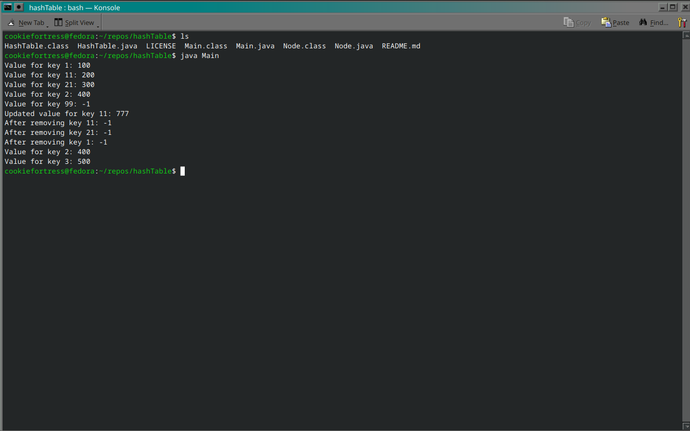

# hashTable
M05 Hash Table Implementation for CSCI-C343

To run this code, navigate to the directory in which you downloaded the repository and enter <code>javac *.java</code> and then <code>java Main</code>.

